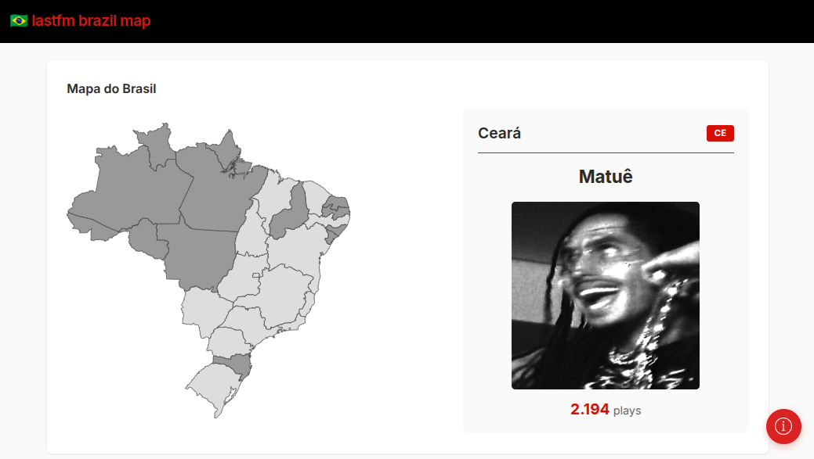

# Last.fm Brazil Map

Mapeie os seus artistas mais escutados no Last.fm por estados do Brasil. Utilizando **React** e **Vite**, o app une dados de múltiplas APIs para gerar um mapa interativo.

## Fluxo de dados

1. Busca os top 200 artistas mais escutados do usuário utilizando a API do **Last.fm**
2. Busca a localização de cada um dos artistas encontrados
   - Primeiro tenta o JSON local (`artists.json`), criado para otimizar busca com uma extensa lista de artistas brasileiros
   - Se não encontrar na lista...
     - Usa a API do **MusicBrainz** para buscar a cidade de origem
     - Se o artista for brasileiro, usa API do **IBGE** para encontrar o estado da cidade fornecida
   - Artistas brasileiros sem estado definido são listados separadamente em um botão flutuante, apenas como aviso
3. Agrupa apenas o artista com mais reproduções por cada estado
4. Usa a API do **Spotify** para conseguir a imagem dos artistas
5. Exibe os resultados no SVG do mapa do Brasil

## Contribuição

Nem todas as informações são possíveis de conseguir pela API do **MusicBrainz** e este também é um dos motivos da existência do JSON local.

Por conta disso, o botão flutuante que lista os artistas que não tiveram estado definido também é importante para caso queira contribuir no JSON local. Envie um PR com os dados atualizados caso queira contribuir!
